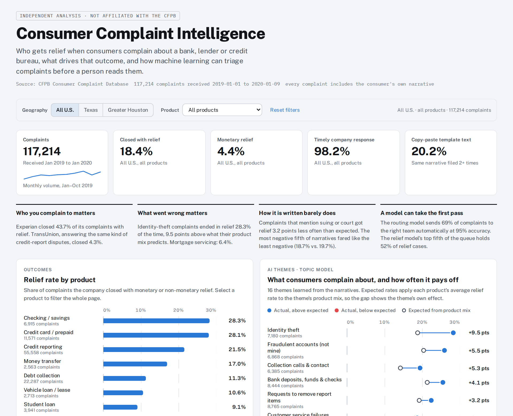
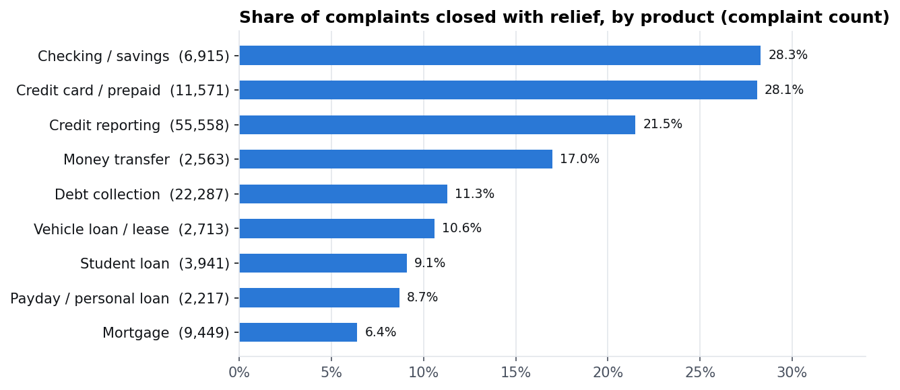
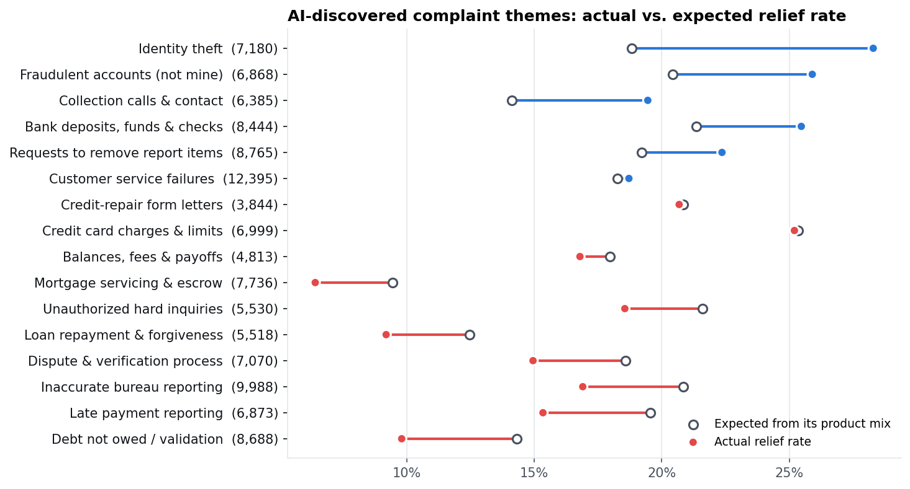
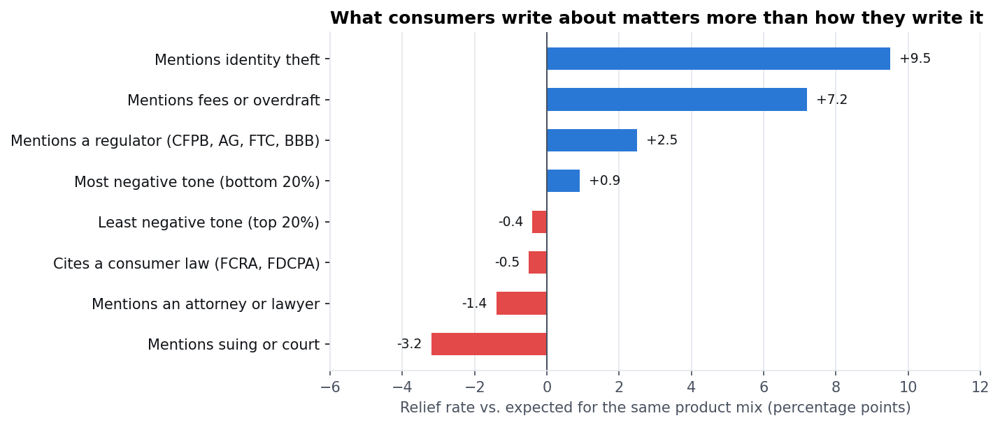
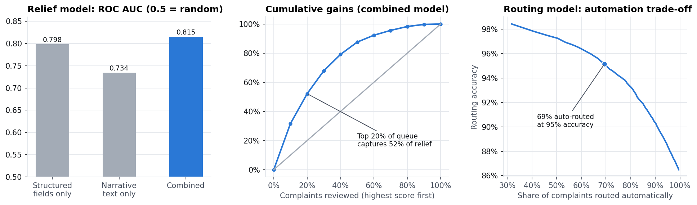

# Consumer Complaint Intelligence

**AI triage and relief analytics on 117,214 CFPB consumer complaints**
Python · SQL · NLP (topic modeling, sentiment) · Machine learning · Interactive dashboard · Power BI-ready model

[](https://github.com/ej770/consumer-complaint-intelligence/actions/workflows/build.yml)



### [Open the live dashboard →](https://ej770.github.io/consumer-complaint-intelligence/)

The dashboard is one self-contained page ([`dashboard/index.html`](dashboard/index.html)). A GitHub Actions workflow rebuilds the whole analysis from the raw CFPB data on every code change and republishes it.

---

## The business problem

Banks, lenders, debt collectors and credit bureaus answer thousands of consumer complaints a month, and the law firms and regulators who watch them read the same complaints from the other side. This project asks two questions:

1. **Which complaints end in relief for the consumer, and why?** Is it the product, the company, the type of problem, or the way the complaint is written?
2. **Can AI take the first pass?** Can a model route each complaint to the right team, and flag the ones most likely to end in relief, before a person reads them?

## Data

- **117,214 complaints** from the CFPB Consumer Complaint Database, received 2019-01-01 to 2020-01-09. Every row includes the consumer's own written narrative (published with consent; names, dates and account numbers masked as `XXXX`). 2,541 companies, 9 product categories.
- Source file: `complaints.csv.gz`, the public extract distributed with Hvitfeldt & Silge, *Supervised Machine Learning for Text Analysis in R* ([github.com/EmilHvitfeldt/smltar](https://github.com/EmilHvitfeldt/smltar)). Original data: [consumerfinance.gov](https://www.consumerfinance.gov/data-research/consumer-complaints/). U.S. government data, public domain.
- **Why this extract matters now:** in August 2026 the CFPB stopped publishing complaint narratives and moved past narratives to an archive, so narrative-level data like this is now archival.
- **Outcome definition:** *relief* = the company closed the complaint "with monetary relief" or "with non-monetary relief" (18.4% of complaints; 4.4% monetary).

## Key findings

| # | Finding | Evidence |
|---|---------|----------|
| 1 | **Who you complain to matters most.** The three credit bureaus handle the same kind of dispute but close them very differently. | Relief rate: Experian **43.7%**, Equifax **25.1%**, TransUnion **4.3%** |
| 2 | **Money problems at banks get fixed; mortgage problems rarely do.** | Checking/savings **28.3%** relief (23.9% monetary), credit cards **28.1%**, mortgage **6.4%** |
| 3 | **What went wrong matters.** A topic model sorted the narratives into 16 themes. Some beat their product mix, some lag it. | Identity theft **28.3%** relief, **+9.5 pts** vs. expected; late-payment disputes **−4.2 pts**; "debt not owed" **−4.5 pts** |
| 4 | **How it's written barely matters, and legal threats don't help.** | Mentions of suing or court: **−3.2 pts** vs. expected. Most negative fifth of narratives (VADER) got relief **18.7%** of the time, least negative fifth **19.7%** |
| 5 | **Concrete, fixable money problems win; disputes over accurate history lose.** | "overdraft fees" **+13.1 pts**, "fraudulent charges" **+12.5**, "fraud alert" **+11.7**; "bankruptcy court" **−9.9**, "garnished" **−7.3**, "repossession" **−6.7** |
| 6 | **One in five complaints is copy-paste text** (credit-repair and identity-theft form letters). | **20.2%** of complaints share their exact text with another; those get relief **23.3%** vs. **17.2%** for unique text |
| 7 | **Texas lags the national relief rate**, partly because of its product mix. | Texas: 10,783 complaints (2,979 Greater Houston), **16.2%** relief vs. **18.6%** elsewhere; debt collection is **23.2%** of Texas complaints vs. **18.6%** elsewhere |

"Expected" rates use **direct standardization**: each product's relief rate (among complaints outside the group) is applied to the group's own product mix. The gap shows the group's effect beyond what its products alone predict.





## AI triage models

Both models are evaluated on a **20% hold-out set split by narrative text group**. Copy-pasted complaints never appear in both training and test data, so the scores aren't inflated by memorized templates.

| Model | Task | Hold-out result |
|-------|------|-----------------|
| **A. Routing classifier** (TF-IDF 1–2 grams + multinomial logistic regression) | Read the narrative, predict which of 9 product teams should handle it | **86.2% accuracy**, macro-F1 **0.80**. At a confidence threshold of 0.86 it routes **69% of complaints automatically at 95% accuracy**; the rest go to a person |
| **B. Relief-likelihood model** (logistic regression on intake-time fields + narrative TF-IDF) | Score each new complaint's chance of ending in relief | ROC AUC **0.815** (structured fields alone: 0.798; text alone: 0.734). The **top 20%** of the queue holds **52%** of all relief cases; the top 10% has a **3.2× lift** |



Where routing struggles: overlapping categories. 21% of vehicle-loan complaints read like credit-reporting complaints, and 17% of payday/personal-loan complaints read like debt collection.

## Approach

| Step | Script | What it does |
|------|--------|--------------|
| 1 | `src/01_clean.py` | Load raw data (downloads it if missing), strip `XXXX` masks, engineer intake-time features: language signals, consumer tags, Greater Houston flag (ZIP 770–775), copy-paste text groups |
| 2 | `src/02_sql_analysis.py` + `sql/*.sql` | Load into SQLite and run 8 SQL analyses (CTEs, window functions, direct standardization) |
| 3 | `src/03_text_ai.py` | TF-IDF + seeded NMF topic model (18 topics → 16 themes), VADER sentiment per sentence, mix-adjusted phrase analysis |
| 4 | `src/04_models.py` | Routing classifier, relief model (3 variants compared), lift/gains, out-of-fold scores for every complaint |
| 5 | `src/05_export.py` | Power BI star schema and compact dashboard data |
| 6 | `src/06_figures.py` | README figures |
| 7 | `src/07_build_dashboard.py` | Builds the self-contained interactive dashboard (filters by geography and product) |
| 8 | `src/08_screenshot.py` | Optional: saves the dashboard screenshot used at the top of this README (needs Playwright) |
| CI | `.github/workflows/build.yml` | GitHub Actions runs steps 1–8, commits the refreshed tables and figures, and publishes the dashboard to GitHub Pages |

## Repository structure

```
├── .github/workflows/build.yml  # CI: rebuild everything and publish the dashboard
├── run_all.py                  # runs steps 1–7 (≈20 min on a laptop)
├── requirements.txt
├── src/                        # pipeline scripts, config.py, tfidf.py (shared helper)
├── sql/                        # 8 standalone SQL analyses
├── outputs/
│   ├── tables/                 # every result table as CSV
│   └── figures/                # charts used in this README
├── dashboard/
│   ├── index.html              # interactive dashboard (open in a browser)
│   └── template.html           # dashboard source (HTML/CSS/JS, no libraries)
└── powerbi/                    # measures.dax (+ star schema CSVs after a local run)
```

## How to run

```bash
pip install -r requirements.txt      # Python 3.11; versions pinned to the published results
python run_all.py
```

The raw file (47 MB) downloads automatically on the first run. All results land in `outputs/`, and the dashboard rebuilds into `dashboard/index.html`.

### Reproducibility

Every run, on any machine, produces the numbers in this README:

- **Same data.** The download is pinned to one commit of the source repository and checked against its SHA-256 checksum.
- **Same libraries.** Versions are pinned in `requirements.txt`.
- **Same vocabulary.** scikit-learn's `max_features` breaks ties at the vocabulary cutoff differently on AVX-512 and AVX2 processors. `src/tfidf.py` breaks them alphabetically instead.
- **Same topics.** An unseeded NMF topic model settled on different topics when only 4 of its 30,000 words changed. Each topic now starts from a few fixed anchor terms (`TOPIC_SEEDS` in `src/03_text_ai.py`), and the themes stay put: changing those 4 words moves fewer than 0.01% of complaints.
- **Same tie-breaking everywhere else.** Rankings use stable sorts, and cross-validation folds come from a seeded shuffle.

## Power BI version

Running `python run_all.py` writes a ready-made star schema to `powerbi/`: `fact_complaints.csv` (one row per complaint, with theme, tone, model scores and routing predictions) plus `dim_product`, `dim_theme`, `dim_company` and `dim_date`. (The CSVs are about 23 MB, so they are created locally rather than stored in the repo.)

1. **Get data → Text/CSV**: load all five files. Set `fact_complaints[date_received]` and `dim_date[date]` to type *Date*.
2. **Model view**: create one-to-many relationships from each dimension to the fact table: `dim_product[product_id]`, `dim_theme[theme_id]`, `dim_company[company_id]` and `dim_date[date]` → `fact_complaints[date_received]`.
3. **Measures**: add the measures in `powerbi/measures.dax` (Relief Rate, Expected Relief Rate (Product Mix), Relief Gap, Relief Capture, Routing Accuracy, and others).
4. **Suggested pages**: *Overview* (KPI cards, relief by product, monthly trend), *Themes* (relief vs. expected by theme), *Companies* (matrix with Relief Gap), *Triage* (relief capture by `relief_priority_decile`, routing accuracy by product).

## Limitations

- Outcomes are **reported by the companies**, so some differences reflect how a company labels its responses, not only how it treats consumers.
- Narratives are published only when consumers **consent**, so this is not every complaint filed.
- Gaps are **associations, not causal effects**; "expected" adjusts for product mix only.
- The extract covers **2019**; narratives published with a lag, so Nov 2019 to Jan 2020 are incomplete (monthly trends use Jan–Oct 2019).

## Skills demonstrated

Python (pandas, NumPy, SciPy) · SQL (CTEs, window functions, standardization) · NLP (TF-IDF, seeded NMF topic modeling, VADER sentiment) · Machine learning (scikit-learn logistic regression, grouped hold-out validation, out-of-fold scoring, lift and gains analysis) · Data visualization (matplotlib; hand-built HTML/JS dashboard) · BI data modeling (star schema, DAX) · Automation and reproducibility (GitHub Actions CI, GitHub Pages, pinned data and dependencies)

---

**Emmanuel Jibiri**, Data Analyst, Houston, TX · [LinkedIn](https://www.linkedin.com/in/ejibiri/) · [Portfolio](https://emmanueljibiri.com/)
